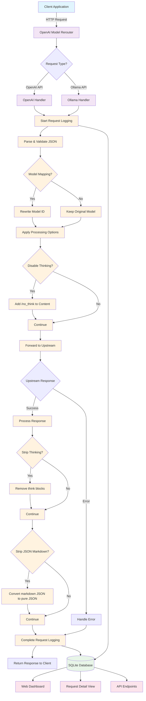

# OpenAI Model Rerouter

A lightweight proxy service that allows you to remap OpenAI-compatible model names on the fly, enabling seamless integration with alternative models and services.

## Overview

This service acts as a transparent proxy between your applications and AI model endpoints, solving the common problem of hard-coded model IDs in applications that don't support custom model configurations.

## Features

- **🔄 Model Mapping**: Redirect any incoming model ID to your preferred model
- **🎯 Flexible Configuration**: Support for exact matches and regex-based patterns
- **📡 Multiple API Support**: Compatible with both OpenAI and Ollama API formats
- **⚡ Streaming Support**: Full support for both streaming and non-streaming responses
- **🧠 Think Chain Processing**: 
  - Strip `<think>...</think>` blocks from responses (enabled by default)
  - Disable internal thinking by appending `/no_think` to prompts
- **📝 JSON Markdown Scrubbing**: 
  - Convert markdown-fenced JSON blocks to pure JSON (configurable)
  - Ideal for models that output JSON in markdown format
- **📊 Request Logging & Web UI**: 
  - SQLite database logging of all requests and responses
  - Clean web dashboard showing request logs with filtering
  - Performance metrics (duration, size, status codes)
  - **🔄 Real-time inflight tracking**: See active requests in progress
  - Automatic cleanup of old logs with database optimization
- **🔌 Drop-in Replacement**: Works as a direct OpenAI API replacement

## Architecture



## Quick Start

### Using Docker

1. **Build the image**
   ```bash
   docker build -t openai-model-rerouter .
   ```

2. **Run the service**
   ```bash
   docker run -d \
     --name openai-model-rerouter \
     --restart unless-stopped \
     -p 1234:1234 \
     -e UPSTREAM_URL="http://localhost:8000" \
     -e MODEL_MAP='{"gpt-3.5-turbo":"llama3-8b","gpt-4":"llama3-70b"}' \
     -e REQUEST_TIMEOUT="60.0" \
     openai-model-rerouter
   ```

### Using Python directly

1. **Install dependencies**
   ```bash
   pip install -r requirements.txt
   ```

2. **Run the service**
   ```bash
   export MODEL_MAP='{"gpt-3.5-turbo":"llama3-8b"}'
   export UPSTREAM_URL="http://localhost:8000"
   python app.py
   ```

### Usage

Point your applications to `http://localhost:1234` instead of the OpenAI API:

```python
import openai

client = openai.OpenAI(
    base_url="http://localhost:1234/v1",
    api_key="your-api-key"  # Pass through to upstream
)

# This will be automatically mapped according to your MODEL_MAP
response = client.chat.completions.create(
    model="gpt-3.5-turbo",  # Gets rewritten to "llama3-8b"
    messages=[{"role": "user", "content": "Hello!"}]
)
```

## Configuration

All configuration is done via environment variables:

| Variable | Default | Description |
|----------|---------|-------------|
| `UPSTREAM_URL` | `http://localhost:8000` | Target API endpoint |
| `OLLAMA_UPSTREAM_URL` | `http://localhost:11434` | Ollama API endpoint for `/api/tags` |
| `MODEL_MAP` | `{}` | JSON mapping of model names (see examples below) |
| `STRIP_THINKING` | `true` | Remove `<think>...</think>` blocks from responses |
| `STRIP_JSON_MARKDOWN` | `false` | Convert markdown-fenced JSON blocks to pure JSON |
| `DISABLE_THINKING` | `false` | Append `/no_think` to prompts |
| `ENABLE_LOGGING` | `true` | Enable request logging and web UI |
| `REQUEST_TIMEOUT` | `60.0` | Timeout for upstream requests in seconds |
| `DB_PATH` | `requests.db` | SQLite database file path |
| `MAX_LOG_AGE_DAYS` | `7` | Auto-delete logs older than this many days |
| `LISTEN_HOST` | `127.0.0.1` | Host to bind to |
| `LISTEN_PORT` | `1234` | Port to listen on |

### Model Mapping Examples

**Exact matches:**
```json
{
  "gpt-3.5-turbo": "llama3-8b",
  "gpt-4": "llama3-70b",
  "text-davinci-003": "codellama-34b"
}
```

**Regex patterns:**
```json
{
  "/gpt-(.*)turbo/": "llama3-\\1-instruct",
  "/gpt-4(.*)$/": "claude-3-opus\\1"
}
```

## API Compatibility

### Supported Inbound Protocols

#### OpenAI API Format
The service fully supports the OpenAI API specification with the following endpoints:

| Endpoint | Method | Streaming | Description |
|----------|--------|-----------|-------------|
| `/v1/chat/completions` | POST | ✅ Yes | Chat-based completions with message history |
| `/v1/completions` | POST | ✅ Yes | Text completions with prompt input |
| `/v1/models` | GET | ❌ No | List available models from upstream |

**Features:**
- ✅ Request/response body preservation
- ✅ Model ID mapping and rewriting
- ✅ Think chain processing and removal
- ✅ JSON markdown conversion
- ✅ Authorization header passthrough
- ✅ Error handling and upstream status codes

#### Ollama API Format
The service converts Ollama API calls to OpenAI format before forwarding:

| Endpoint | Method | Streaming | Description |
|----------|--------|-----------|-------------|
| `/api/generate` | POST | ✅ Yes | Generate text from prompt (converted to chat format) |
| `/api/chat` | POST | ✅ Yes | Chat completions (mapped to OpenAI format) |
| `/api/tags` | GET | ❌ No | List available models (proxied to Ollama upstream) |

**Conversion Details:**
- `/api/generate` → `/v1/chat/completions` (prompt converted to user message)
- `/api/chat` → `/v1/chat/completions` (messages array passed through)
- Response format converted back to Ollama JSON structure
- Model names preserved in Ollama response format

### Processing Features

#### Model Mapping
- **Exact Match**: `"gpt-4" → "claude-3-opus"`
- **Regex Patterns**: `"/gpt-(.*)/" → "claude-3-\\1"`
- Applied before forwarding to upstream
- Original and mapped models logged for tracking

#### Content Processing
- **Think Chain Removal**: Strips `<think>...</think>` blocks from responses
- **JSON Markdown Conversion**: Converts \`\`\`json blocks to pure JSON
- **Thinking Disable**: Appends `/no_think` to prompts when enabled
- Applied to both streaming and non-streaming responses

#### Error Handling
- **Connection Errors**: 502 Bad Gateway with detailed error message
- **Timeout Errors**: 504 Gateway Timeout with configurable timeout
- **Malformed JSON**: 400 Bad Request for invalid request bodies
- **Upstream Errors**: Status codes and error messages passed through

### Web UI & Monitoring
- `GET /` - Web dashboard showing request logs and statistics
- `GET /request/{id}` - Detailed view of a specific request with full transcript
- `GET /api/logs` - JSON API for retrieving request logs
- `GET /api/stats` - JSON API for getting usage statistics
- `GET /api/inflight` - JSON API for getting currently active requests

The web UI provides a clean interface showing:
- **🔄 Real-time inflight tracking**: See requests currently being processed
- **🔍 Detailed request view**: Click any request to see full transcript with collapsible sections
- Request logs with source, destination, service type, and performance metrics
- Statistics overview (total requests, by service type, recent activity, inflight count)
- Model mapping indicators when models are rewritten
- Error tracking and status codes with completion status

## Development

### Running Tests
```bash
pip install -r requirements.txt
pytest test_app.py -v
```

### Contributing
This project is open source. Feel free to submit issues and pull requests!

## License
MIT License - see LICENSE file for details.  
