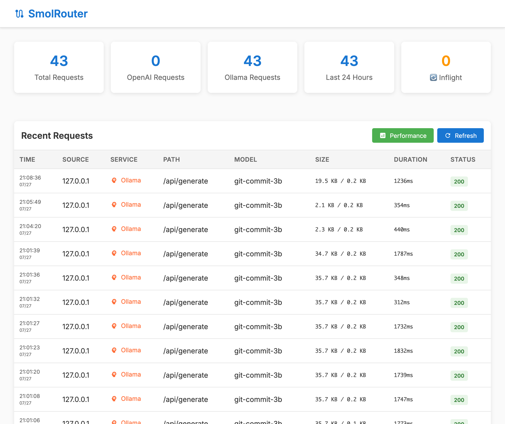

# SmolRouter

A smart, lightweight proxy for routing AI model requests with performance analytics. Perfect for local LLM enthusiasts who want intelligent routing, real-time monitoring, and seamless model switching.

## Quick Start

### Using Docker

1.  **Build the image:**
    ```bash
    docker build -t smolrouter .
    ```

2.  **Run the container:**
    ```bash
    docker run -d \
      --name smolrouter \
      --restart unless-stopped \
      -p 1234:1234 \
      -e DEFAULT_UPSTREAM="http://localhost:8000" \
      -e MODEL_MAP='{"gpt-3.5-turbo":"llama3-8b"}' \
      -v ./routes.yaml:/app/routes.yaml \
      smolrouter
    ```

### Using Python

1.  **Install SmolRouter:**
    ```bash
    pip install smolrouter
    ```

2.  **Run the application:**
    ```bash
    export DEFAULT_UPSTREAM="http://localhost:8000"
    export MODEL_MAP='{"gpt-3.5-turbo":"llama3-8b"}'
    smolrouter
    ```

### Usage

Point your applications to `http://localhost:1234` instead of the OpenAI API:

```python
import openai

client = openai.OpenAI(
    base_url="http://localhost:1234/v1",
    api_key="your-api-key"  # This is passed through to the upstream server
)

response = client.chat.completions.create(
    model="gpt-3.5-turbo",  # This will be rewritten to "llama3-8b"
    messages=[{"role": "user", "content": "Hello!"}]
)
```

<p align="center">
  
</p>

## Core Features

### Smart Routing
- **Host-based & Model-based Routing:** Route requests from specific IPs or for specific models to different upstream servers.
- **Regex & Exact Matching:** Use regex patterns (e.g., `"/.*-8b/"`) or exact model names for flexible routing.
- **Model Overrides:** Automatically change model names on-the-fly for each route.
- **YAML Configuration:** Define all routing rules in a simple, human-readable `routes.yaml` file.

### Performance Analytics & Monitoring
- **Interactive Dashboard:** A web UI to view real-time and historical request data.
- **Performance Scatter Plots:** Visualize token counts vs. response times to compare model performance.
- **Detailed Request Views:** Inspect the full request/response transcripts for any logged event.
- **SQLite Backend:** All request data is stored in a local SQLite database for persistence.

### API Compatibility & Content Processing
- **OpenAI & Ollama Support:** Acts as a drop-in replacement for both OpenAI and Ollama APIs.
- **Model Mapping:** Remap model names using a simple JSON object for legacy or alternative model support.
- **Streaming Support:** Full support for streaming responses for both API formats.
- **Content Manipulation:**
    - **Think-Chain Stripping:** Automatically remove `<think>...</think>` blocks from responses.
    - **JSON Markdown Scrubbing:** Convert markdown-fenced JSON into pure JSON.

## Configuration

### Environment Variables

| Variable                | Default                   | Description                                                              |
| ----------------------- | ------------------------- | ------------------------------------------------------------------------ |
| `DEFAULT_UPSTREAM`      | `http://localhost:8000`   | The default upstream server to use when no routing rules match.          |
| `ROUTES_CONFIG`         | `routes.yaml`             | Path to the YAML/JSON file containing smart routing rules.               |
| `MODEL_MAP`             | `{}`                      | A JSON string for simple, legacy model name remapping.                   |
| `STRIP_THINKING`        | `true`                    | If `true`, removes `<think>...</think>` blocks from responses.            |
| `STRIP_JSON_MARKDOWN`   | `false`                   | If `true`, converts markdown-fenced JSON blocks to pure JSON.            |
| `DISABLE_THINKING`      | `false`                   | If `true`, appends a `/no_think` marker to prompts to disable thinking.  |
| `ENABLE_LOGGING`        | `true`                    | If `true`, enables request logging and the web UI.                       |
| `REQUEST_TIMEOUT`       | `3000.0`                  | Timeout in seconds for upstream requests.                                |
| `DB_PATH`               | `requests.db`             | Path to the SQLite database file.                                        |
| `MAX_LOG_AGE_DAYS`      | `7`                       | Automatically delete logs older than this many days.                     |
| `LISTEN_HOST`           | `127.0.0.1`               | The host address for the application to bind to.                         |
| `LISTEN_PORT`           | `1234`                    | The port for the application to listen on.                               |
| `JWT_SECRET`            | `(none)`                  | JWT secret key for authentication. Must be 32+ chars, cryptographically secure. |
| `BLOB_STORAGE_TYPE`     | `filesystem`              | Blob storage backend: `filesystem` or `memory`.                          |
| `BLOB_STORAGE_PATH`     | `blob_storage`            | Path for filesystem blob storage (side-car request/response storage).    |
| `MAX_BLOB_SIZE`         | `10485760` (10MB)         | Maximum size for individual request/response blobs (bytes).              |
| `MAX_TOTAL_STORAGE_SIZE`| `1073741824` (1GB)        | Maximum total size for all blob storage (bytes).                         |
| `WEBUI_SECURITY`        | `AUTH_WHEN_PROXIED`       | WebUI security policy: `NONE`, `AUTH_WHEN_PROXIED`, or `ALWAYS_AUTH`.    |

### Smart Routing with Model Aliases (`routes.yaml`)

SmolRouter now supports advanced routing with **model aliases** and **automatic failover**. Create a `routes.yaml` file to define your routing logic.

#### Model Aliases with Automatic Failover

```yaml
# Define your servers for easy reference
servers:
  fast-box: "http://192.168.1.100:8000"
  slow-box: "http://192.168.1.101:8000"
  gpu-server: "http://192.168.1.102:8000"

# Model aliases with automatic failover
aliases:
  git-commit-model:
    instances:
      - "fast-box/llama3-8b"      # Try fast-box first
      - "slow-box/llama3-3b"      # Fallback to slow-box
  
  coding-assistant:
    instances:
      - server: "gpu-server"
        model: "codellama-34b"
      - server: "fast-box" 
        model: "llama3-8b"

# Traditional routing rules (evaluated after aliases)
routes:
  # Route requests for small models to a specific GPU server using regex
  - match:
      model: "/.*-1.5b/"
    route:
      upstream: "http://gpu-server:8000"

  # Route requests from a specific developer's machine to a dev server
  - match:
      source_host: "10.0.1.100"
    route:
      upstream: "http://dev-server:8000"

  # Route requests for "gpt-4" and override the model name to "claude-3-opus"
  - match:
      model: "gpt-4"
    route:
      upstream: "http://claude-server:8000"
      model: "claude-3-opus"
```

When a client requests `git-commit-model`, SmolRouter will:
1. Try `fast-box` with `llama3-8b` model
2. If that fails, automatically try `slow-box` with `llama3-3b` model
3. Return an error only if all instances fail

#### JWT Authentication

Enable JWT authentication by setting a cryptographically secure `JWT_SECRET`:

```bash
# Generate a secure 256-bit key (recommended)
export JWT_SECRET=$(openssl rand -base64 32)
smolrouter

# Or use your own secure key (minimum 32 characters)
export JWT_SECRET="your-cryptographically-secure-random-key-here-32plus-chars"
```

**Security Requirements:**
- Minimum 32 characters in length
- Must not be a common/default secret (e.g., "password", "secret")
- Must have good entropy (at least 8 unique characters)
- Whitespace is automatically trimmed

All API endpoints will then require a valid Bearer token. Weak secrets are automatically rejected with clear error messages.

#### Side-car Blob Storage

Request and response bodies are now stored in a separate blob storage system (filesystem by default) instead of directly in SQLite. This improves database performance with large payloads:

```bash
export BLOB_STORAGE_TYPE="filesystem"  # or "memory"
export BLOB_STORAGE_PATH="./blob_storage"
```

#### Web UI Security Policies

⚠️ **Security Notice**: SmolRouter is designed for internal use behind a reverse proxy. **Do not expose it directly to the internet.** Always use nginx, Cloudflare, or another reverse proxy for internet-facing deployments.

Configure WebUI security with the `WEBUI_SECURITY` environment variable:

```bash
# For development (local access only) - NOT for production
export WEBUI_SECURITY="NONE"

# Default: Require JWT when accessed through reverse proxy (recommended)
export WEBUI_SECURITY="AUTH_WHEN_PROXIED"
export JWT_SECRET="your-secret-key"

# Always require JWT authentication (maximum security)
export WEBUI_SECURITY="ALWAYS_AUTH"  
export JWT_SECRET="your-secret-key"
```

**Security Policy Behavior:**

| Policy | Direct Access | Through Reverse Proxy | Notes |
|--------|---------------|----------------------|-------|
| `NONE` | ✅ No auth | ✅ No auth | ⚠️ **Only for development** |
| `AUTH_WHEN_PROXIED` | ✅ No auth | ❌ **Disabled** | ✅ **Recommended default** |
| `ALWAYS_AUTH` | 🔐 JWT required | 🔐 JWT required | 🔒 **Maximum security** |

**Configuration Validation:**
- If `ALWAYS_AUTH` is set without `JWT_SECRET`, SmolRouter will log an error and the WebUI will be inaccessible
- `AUTH_WHEN_PROXIED` doesn't require JWT configuration since it simply disables the WebUI when proxied

**Reverse Proxy Detection:**
SmolRouter automatically detects reverse proxy requests by checking for common headers:
- `X-Forwarded-For`, `X-Real-IP`, `CF-Connecting-IP`
- `X-Forwarded-Proto`, `X-Forwarded-Host`

**Advanced Usage:**
Advanced users who need WebUI access through a reverse proxy can:
- Set `WEBUI_SECURITY=NONE` (not recommended for internet-facing deployments)
- Configure their reverse proxy to strip proxy headers for specific routes
- Access SmolRouter directly (bypassing the reverse proxy) for WebUI usage

## Web UI & Monitoring

The web UI provides insights into your model usage and performance.

- **Dashboard (`/`):** View the latest request logs and general statistics.
- **Performance (`/performance`):** Analyze model performance with an interactive scatter plot.
- **Request Detail (`/request/{id}`):** See the full transcript of a specific request.

## Development

### Running Tests

To run the test suite, use `pytest`:

```bash
pytest
```

### Contributing

This project is open source. Please feel free to submit issues and pull requests.

## License

This project is licensed under the MIT License. See the `LICENSE` file for details.