# SmolRouter

A smart, lightweight proxy for routing AI model requests with performance analytics. Perfect for local LLM enthusiasts who want intelligent routing, real-time monitoring, and seamless model switching.

## Overview

SmolRouter acts as an intelligent proxy between your applications and AI model endpoints, solving the common problems of hard-coded model IDs and inefficient resource allocation. Route different models to different servers, monitor performance, and optimize your local LLM setup with ease.

## Features

### 🎯 **Smart Routing**
- **Host-based routing**: Route requests from specific IPs to dedicated servers
- **Model-based routing**: Send different models to different upstreams automatically
- **Regex pattern matching**: Flexible model matching with `/pattern/` syntax
- **Model overrides**: Change model names per route (e.g., `gpt-4` → `llama3-70b`)
- **YAML/JSON configuration**: Simple, readable routing configuration

### 📊 **Performance Analytics** 
- **Real-time scatter plots**: Visualize tokens vs response time by model
- **Interactive dashboard**: Filter by time, model, service type
- **Token counting**: Accurate prompt/completion token tracking
- **Performance metrics**: Duration, size, throughput analysis
- **Model comparison**: See which models perform best for different workloads

### 🔄 **Model Management**
- **Legacy model mapping**: Simple JSON-based model name remapping  
- **Multiple API support**: OpenAI and Ollama API compatibility
- **Streaming support**: Full support for real-time streaming responses
- **Think chain processing**: Strip `<think>...</think>` blocks automatically
- **JSON markdown scrubbing**: Convert ````json` blocks to pure JSON

### 📈 **Monitoring & Logging**
- **Real-time inflight tracking**: See active requests in progress
- **Request detail views**: Full transcript with collapsible sections
- **SQLite logging**: Persistent request/response storage
- **Automatic cleanup**: Configurable log retention
- **Web dashboard**: Clean, responsive Material Design UI

### 🚀 **Developer Experience**
- **Drop-in replacement**: Works as direct OpenAI API replacement
- **Environment-based config**: Simple setup with environment variables
- **YAML configuration**: Human-readable routing rules
- **Comprehensive logging**: Debug and monitor everything

## Architecture

```mermaid
flowchart TD
    A[Client Application] -->|HTTP Request| B[SmolRouter]
    B --> C{Request Type?}
    
    C -->|OpenAI API| D[OpenAI Handler]
    C -->|Ollama API| E[Ollama Handler]
    
    D --> F[Extract Source IP & Model]
    E --> F
    
    F --> G[🎯 Smart Routing Engine]
    G --> H{Route Match?}
    H -->|Host Match| I[Route to Host-Specific Server]
    H -->|Model Match| J[Route to Model-Specific Server]
    H -->|No Match| K[Use Default Route]
    
    I --> L[Apply Model Override]
    J --> L
    K --> M[Legacy Model Mapping]
    M --> L
    
    L --> N[Start Request Logging]
    N --> O[Apply Processing Options]
    
    O --> P{Disable Thinking?}
    P -->|Yes| Q[Add /no_think to Content]
    P -->|No| R[Continue]
    Q --> R
    
    R --> S[Forward to Selected Upstream]
    S --> T{Upstream Response}
    
    T -->|Success| U[Process Response]
    T -->|Error| V[Handle Error]
    
    U --> W{Strip Thinking?}
    W -->|Yes| X[Remove think blocks]
    W -->|No| Y[Continue]
    X --> Y
    
    Y --> Z{Strip JSON Markdown?}
    Z -->|Yes| AA[Convert markdown JSON to pure JSON]
    Z -->|No| BB[Continue]
    AA --> BB
    
    BB --> CC[📊 Track Performance Metrics]
    CC --> DD[Complete Request Logging]
    V --> DD
    
    DD --> EE[Return Response to Client]
    
    %% Multiple Upstreams
    S --> FF[GPU Server :8000]
    S --> GG[CPU Server :8001]
    S --> HH[Dev Server :8002]
    
    %% Logging & Monitoring
    N --> II[(SQLite Database)]
    DD --> II
    CC --> II
    
    II --> JJ[📊 Performance Dashboard]
    II --> KK[🔍 Request Detail View]
    II --> LL[📈 Analytics API]
    
    %% Configuration
    MM[routes.yaml] --> G
    NN[Environment Variables] --> G
    
    %% Styling for better dark theme accessibility
    classDef client fill:#e1f5fe,stroke:#01579b,stroke-width:2px,color:#000
    classDef router fill:#f3e5f5,stroke:#4a148c,stroke-width:2px,color:#000
    classDef routing fill:#fff3e0,stroke:#e65100,stroke-width:2px,color:#000
    classDef server fill:#e8f5e8,stroke:#1b5e20,stroke-width:2px,color:#000
    classDef monitoring fill:#fce4ec,stroke:#880e4f,stroke-width:2px,color:#000
    classDef config fill:#f1f8e9,stroke:#33691e,stroke-width:2px,color:#000
    
    class A client
    class B,D,E router
    class F,G,H,I,J,K,L,M,N,O,P,Q,R,S,U,W,X,Y,Z,AA,BB,CC,DD routing
    class FF,GG,HH server
    class II,JJ,KK,LL monitoring
    class MM,NN config
```



## Quick Start

### Using Docker

1. **Build the image**
   ```bash
   docker build -t openai-model-rerouter .
   ```

2. **Run the service**
   ```bash
   docker run -d \
     --name smolrouter \
     --restart unless-stopped \
     -p 1234:1234 \
     -e DEFAULT_UPSTREAM="http://localhost:8000" \
     -e MODEL_MAP='{"gpt-3.5-turbo":"llama3-8b","gpt-4":"llama3-70b"}' \
     -e REQUEST_TIMEOUT="60.0" \
     -v ./routes.yaml:/app/routes.yaml \
     smolrouter
   ```

### Using Python directly

1. **Install dependencies**
   ```bash
   pip install -r requirements.txt
   ```

2. **Run the service**
   ```bash
   export MODEL_MAP='{"gpt-3.5-turbo":"llama3-8b"}'
   export DEFAULT_ROUTE="http://localhost:8000"
   export ROUTES_CONFIG="routes.yaml"  # Optional: for smart routing
   python app.py
   ```

### Usage

Point your applications to `http://localhost:1234` instead of the OpenAI API:

```python
import openai

client = openai.OpenAI(
    base_url="http://localhost:1234/v1",
    api_key="your-api-key"  # Pass through to upstream
)

# This will be automatically mapped according to your MODEL_MAP
response = client.chat.completions.create(
    model="gpt-3.5-turbo",  # Gets rewritten to "llama3-8b"
    messages=[{"role": "user", "content": "Hello!"}]
)
```

## Configuration

### Environment Variables

| Variable | Default | Description |
|----------|---------|-------------|
| `DEFAULT_UPSTREAM` | `http://localhost:8000` | Default OpenAI-compatible server when no route matches |
| `ROUTES_CONFIG` | `routes.yaml` | Path to YAML/JSON routing configuration |
| `MODEL_MAP` | `{}` | Legacy JSON mapping of model names |
| `STRIP_THINKING` | `true` | Remove `<think>...</think>` blocks from responses |
| `STRIP_JSON_MARKDOWN` | `false` | Convert markdown-fenced JSON blocks to pure JSON |
| `DISABLE_THINKING` | `false` | Append `/no_think` to prompts |
| `ENABLE_LOGGING` | `true` | Enable request logging and web UI |
| `REQUEST_TIMEOUT` | `60.0` | Timeout for upstream requests in seconds |
| `DB_PATH` | `requests.db` | SQLite database file path |
| `MAX_LOG_AGE_DAYS` | `7` | Auto-delete logs older than this many days |
| `LISTEN_HOST` | `127.0.0.1` | Host to bind to |
| `LISTEN_PORT` | `1234` | Port to listen on |

### Smart Routing Configuration

Create a `routes.yaml` file for intelligent request routing:

```yaml
routes:
  # Route fast models to GPU server
  - match:
      model: "/.*-1.5b/"  # Regex: any model ending in -1.5b
    route:
      upstream: "http://gpu-server:8000"
  
  # Route specific client to dev server  
  - match:
      source_host: "10.0.1.100"  # Developer's machine
    route:
      upstream: "http://dev-server:8000"
  
  # Route with model override
  - match:
      model: "gpt-4"
    route:
      upstream: "http://claude-server:8000"
      model: "claude-3-opus"  # Override model name
```

**Route matching:**
- **`source_host`**: Match client IP address (useful for per-user routing)
- **`model`**: Match model name (exact or regex with `/pattern/`)
- **First match wins** - routes are evaluated in order
- **Optional fields** - match on either source_host, model, or both

### Model Mapping Examples

**Exact matches:**
```json
{
  "gpt-3.5-turbo": "llama3-8b",
  "gpt-4": "llama3-70b",
  "text-davinci-003": "codellama-34b"
}
```

**Regex patterns:**
```json
{
  "/gpt-(.*)turbo/": "llama3-\\1-instruct",
  "/gpt-4(.*)$/": "claude-3-opus\\1"
}
```

## API Compatibility

### Supported Inbound Protocols

#### OpenAI API Format
The service fully supports the OpenAI API specification with the following endpoints:

| Endpoint | Method | Streaming | Description |
|----------|--------|-----------|-------------|
| `/v1/chat/completions` | POST | ✅ Yes | Chat-based completions with message history |
| `/v1/completions` | POST | ✅ Yes | Text completions with prompt input |
| `/v1/models` | GET | ❌ No | List available models from upstream |

**Features:**
- ✅ Request/response body preservation
- ✅ Model ID mapping and rewriting
- ✅ Think chain processing and removal
- ✅ JSON markdown conversion
- ✅ Authorization header passthrough
- ✅ Error handling and upstream status codes

#### Ollama API Format
The service converts Ollama API calls to OpenAI format before forwarding:

| Endpoint | Method | Streaming | Description |
|----------|--------|-----------|-------------|
| `/api/generate` | POST | ✅ Yes | Generate text from prompt (converted to chat format) |
| `/api/chat` | POST | ✅ Yes | Chat completions (mapped to OpenAI format) |
| `/api/tags` | GET | ❌ No | List available models (proxied to Ollama upstream) |

**Conversion Details:**
- `/api/generate` → `/v1/chat/completions` (prompt converted to user message)
- `/api/chat` → `/v1/chat/completions` (messages array passed through)
- Response format converted back to Ollama JSON structure
- Model names preserved in Ollama response format

### Processing Features

#### Model Mapping
- **Exact Match**: `"gpt-4" → "claude-3-opus"`
- **Regex Patterns**: `"/gpt-(.*)/" → "claude-3-\\1"`
- Applied before forwarding to upstream
- Original and mapped models logged for tracking

#### Content Processing
- **Think Chain Removal**: Strips `<think>...</think>` blocks from responses
- **JSON Markdown Conversion**: Converts \`\`\`json blocks to pure JSON
- **Thinking Disable**: Appends `/no_think` to prompts when enabled
- Applied to both streaming and non-streaming responses

#### Error Handling
- **Connection Errors**: 502 Bad Gateway with detailed error message
- **Timeout Errors**: 504 Gateway Timeout with configurable timeout
- **Malformed JSON**: 400 Bad Request for invalid request bodies
- **Upstream Errors**: Status codes and error messages passed through

### Web UI & Monitoring

**Dashboard Endpoints:**
- `GET /` - Main dashboard with request logs and statistics
- `GET /performance` - **Performance analytics with interactive scatter plots**
- `GET /request/{id}` - Detailed request view with full transcript

**API Endpoints:**
- `GET /api/logs` - Request logs (JSON)
- `GET /api/stats` - Usage statistics (JSON)
- `GET /api/inflight` - Currently active requests (JSON)
- `GET /api/performance` - **Performance data for analytics** (JSON)

**Key Features:**
- **📊 Performance Analytics**: Interactive scatter plots showing tokens vs response time by model
- **🔄 Real-time inflight tracking**: See requests currently being processed
- **🔍 Detailed request views**: Click any request for full transcript with collapsible sections
- **📈 Model comparison**: Visualize which models perform best for different workloads
- **⚡ Auto-refresh**: Real-time updates every 30 seconds
- **📱 Mobile responsive**: Clean, accessible design on all devices

**Analytics Features:**
- **Token tracking**: Accurate prompt/completion token counting
- **Performance metrics**: Duration, throughput, error rates by model
- **Time-based filtering**: Analyze performance over different time periods
- **Model-specific insights**: Compare efficiency across different models
- **Interactive charts**: Hover for detailed metrics, filter by service type

## Development

### Running Tests
```bash
pip install -r requirements.txt
pytest test_app.py -v
```

### Contributing
This project is open source. Feel free to submit issues and pull requests!

## License
MIT License - see LICENSE file for details.  
